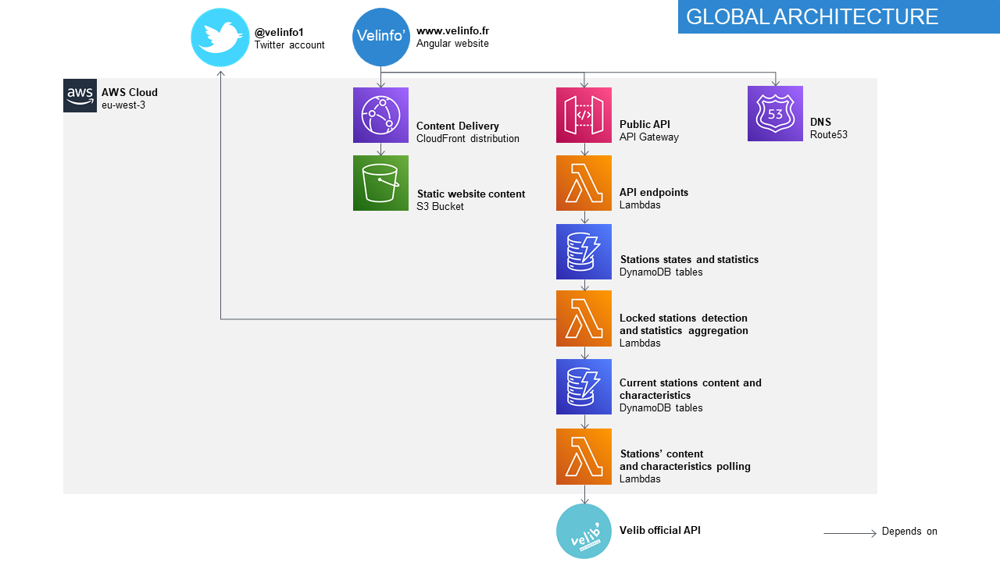

# velinfo
A serveless application to detect locked Velib stations (Paris' bicycle sharing system).
Hosted on AWS Serveless and visible at https://www.velinfo.fr and [@Velinfo1](https://twitter.com/velinfo1)

The raw data comes from the [Velib official API](https://www.velib-metropole.fr/donnees-open-data-gbfs-du-service-velib-metropole). Thanks to them!

## Architecture 


The DNS records are managed through Route53.

The frontend application is built with Angular, hosted using a S3 bucket and cached through a Cloudfront Distribution.

The backend consist of several TypeScript Lambdas and Dynamo tables processing data fetched from the Velib API. The resulting data is exposed through an AWS API Gateway.

## Technical stack
- **Languages** : Typescript, both for the backend (AWS Lambda) and the frontend (Angular)
- **Data storage** : AWS DynamoDb
- **Infrastructure / Deployment tooling** : [AWS SAM](https://docs.aws.amazon.com/serverless-application-model/latest/developerguide/what-is-sam.html) (superset of AWS CloudFormation dedicated to the serverless applications)
- **Main Libraries used** : 
    - [aws-sdk](https://www.npmjs.com/package/aws-sdk) for everything AWS
    - [date-fns](https://www.npmjs.com/package/date-fns) for easing the date management without the overhead of moment
    - [class-transformer](https://www.npmjs.com/package/class-transformer) to simplify the conversion between Typescript / ES6 types and the Dynamo stored objects.
    - [twit](https://www.npmjs.com/package/twit) to use the Twitter API
    - [axios](https://www.npmjs.com/package/axios) to easily fetch data from the Velib API
    - [aws-sam-webpack-plugin](https://www.npmjs.com/package/aws-sam-webpack-plugin) to use TypeScript within AWS SAM
    - [@angular/material](https://www.npmjs.com/package/@angular/material) to use pre built Angular components
    - [@agm/core](https://www.npmjs.com/package/@agm/core) for an easy Google Map / Angular integration
    - [@swimlane/ngx-charts](https://www.npmjs.com/package/@swimlane/ngx-charts) for nice Angular charts

## Build and deploy 
What do you need ?
- NPM
- The AWS SAM CLI
- The Angular CLI

If you want to self host this application, it's possible. But, the SAM template expect a certain number of parameter, mainly regarding the DNS certificates and the Twitter API keys, that are obviously not included in this repo.
### Backend
``` 
npm run build
sam deploy
``` 
The backend code is in the /lambda folder. The infrastructure configuration is defined in template.yml (a SAM template). As TypeScript is not natively supported by SAM, we can't rely on ``sam build``. Instead the build and preparation of the CloudFormation template is done via a custom build command

### Frontend
```
cd frontend
ng build --prod
aws s3 rm s3://velinfo-frontend --recursive
aws s3 cp dist/velinfo s3://velinfo-frontend --recursive --cache-control max-age=31536000
```
The frontend is a standard Angular application which can be built using the [Angular CLI](https://angular.io/cli). Once built, the content need to be pushed to the S3 bucket hosting the static part of the website.
